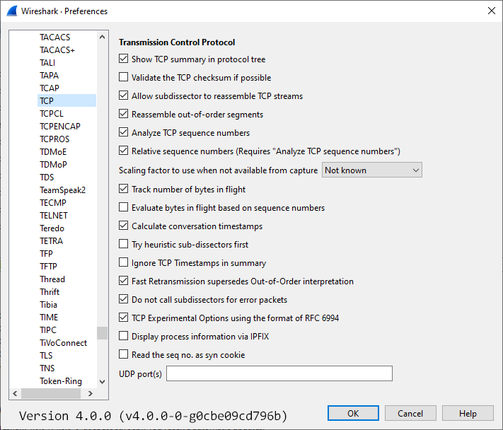

# Transmission Control Protocol (TCP)

The TCP protocol provides stream based connection oriented transfer of data of the [InternetProtocolFamily](/InternetProtocolFamily).

It provides the described TCP port multiplexing and much more. It establishes a logical connection, which is reliable against the problems of [PacketLoss](/PacketLoss), [DuplicatePackets](/DuplicatePackets) and such.

Sending a few bytes will transfer them to the remote host, without giving any additional faulty or missing bytes to the receiving application.

## History

When Vint Cerf and Bob Kahn first wrote the specifications for the protocol in 1973, the Internet was prohibited from commercial use. In May, 1974, the Institute of Electrical and Electronic Engineers (IEEE) published a paper entitled "*A Protocol for Packet Network Interconnection*." As the paper's authors, Cerf and Kahn described an internetworking protocol for sharing resources using packet-switching among the nodes. A central control component of this model was the *Transmission Control Program* that incorporated both connection-oriented links and datagram services between hosts. The monolithic Transmission Control Program was later divided into a modular architecture consisting of the *Transmission Control Protocol* at the connection-oriented layer and the *Internet Protocol* at the internetworking (datagram) layer. The model became known informally as *TCP/IP*, although formally it was henceforth called the *Internet Protocol Suite*.

## Protocol dependencies

  - [IP](/IP): Typically, TCP uses [IP](/IP) as its underlying protocol. The assigned protocol number for TCP on IP is 6.

## Example traffic

XXX - Add example traffic here (as plain text or Wireshark screenshot).

[SampleCaptures/200722\_tcp\_anon.pcapng](uploads/__moin_import__/attachments/SampleCaptures/200722_tcp_anon.pcapng) Netcat client and server - string, file and characters.

## Wireshark

TCP dissector is fully functional.

You can select a TCP stream very fast by using the Follow TCP stream feature. First select a TCP packet in the packet list pane and then click the menu item *Analyze/Follow TCP Stream*

There are two statistical menu items for TCP available: *Statistics/Endpoints* which contains a tab showing all TCP endpoints (combination of IP address and TCP port) and *Statistics/Conversations*, which contains a tab showing all TCP conversations (combination of two endpoints).

## Preference Settings



  - [TCP\_Reassembly](/TCP_Reassembly)

  - [TCP\_Checksum\_Verification](/TCP_Checksum_Verification)

  - [TCP\_Analyze\_Sequence\_Numbers](/TCP_Analyze_Sequence_Numbers)

  - [TCP\_Relative\_Sequence\_Numbers](/TCP_Relative_Sequence_Numbers) and TCP Window Scaling

## Example capture file

XXX - Add a simple example capture file. Keep it short, it's also a good idea to gzip it to make it even smaller, as Wireshark can open gzipped files automatically.

## Display Filter

A complete list of TCP display filter fields can be found in the [display filter reference](http://www.wireshark.org/docs/dfref/t/tcp.html)

Show only the TCP based traffic:

``` 
 tcp
```

Show only the traffic to and from TCP port 80 (usually [HTTP](/HTTP)):

``` 
 tcp.port == 80
```

## Capture Filter

Capture only the TCP based traffic:

``` 
 tcp
```

## External links

  - [RFC793](http://www.ietf.org/rfc/rfc793.txt) TRANSMISSION CONTROL PROTOCOL

## Discussion

---

Imported from https://wiki.wireshark.org/Transmission_Control_Protocol on 2020-08-11 23:26:52 UTC
