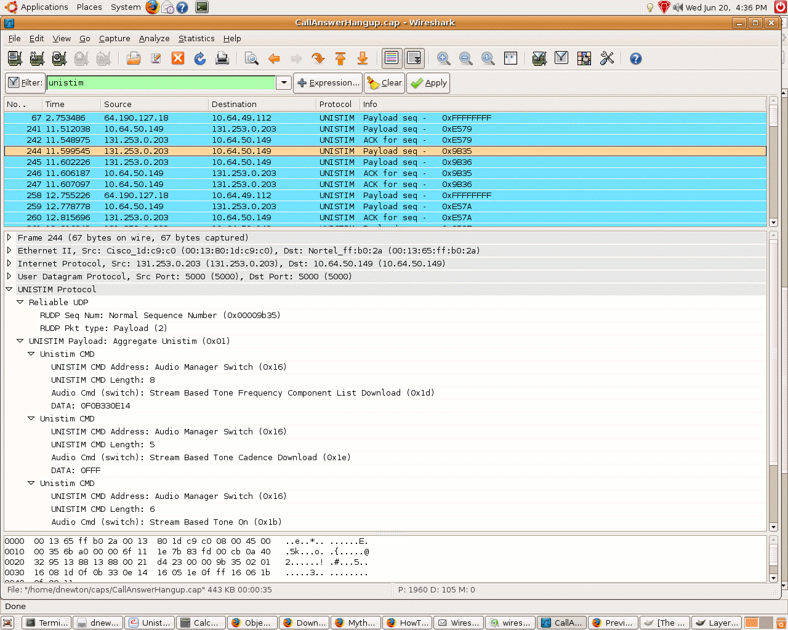
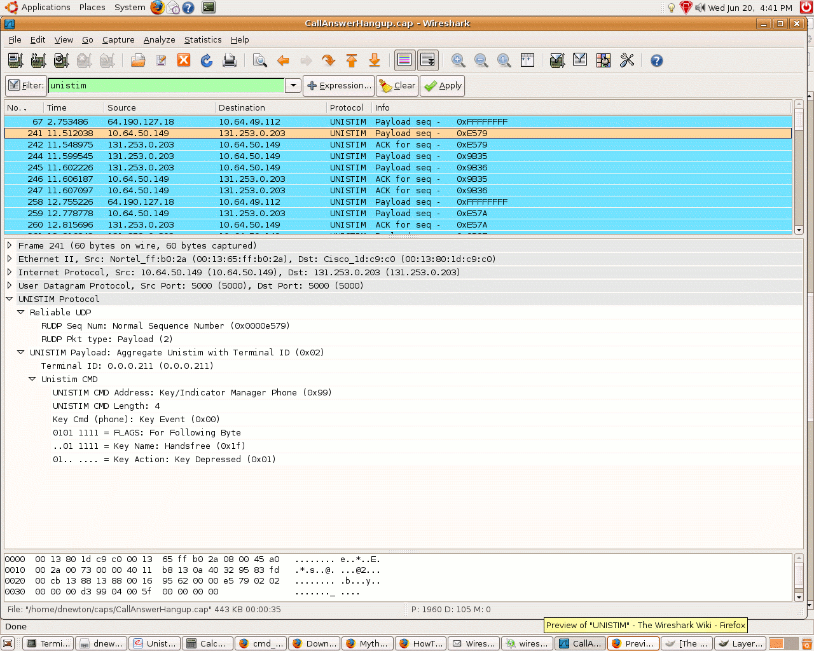

# Unified Networks IP Stimulus (UNIStim)

Unistim is a Nortel proprietary VOIP protocol. It is a lower level protocol than [SIP](/SIP) or most other VOIP protocols. It's important to always think of the phone as a very dumb terminal. Whereas with [SIP](/SIP), the phone has a basic understanding of a phone call,in Unistim the phone knows how to send key press events, display text, flash light, and stream audio. All intelligence is at the switch layer. Like [SIP](/SIP) Unistim does use [RTP](/RTP) as its audio transport. Nortel has broken up the commands into 6 managers each having a set of phone initiated and switch initiated commands. The managers are Basic, Broadcast, Audio, Key/Indicator, Display, Broadcast. Unistim general layout:

<div>

<table>
<tbody>
<tr class="odd">
<td><p>RUDP Sequence ID MSB</p></td>
</tr>
<tr class="even">
<td><p>...</p></td>
</tr>
<tr class="odd">
<td><p>...</p></td>
</tr>
<tr class="even">
<td><p>RUDP Sequence ID LSB</p></td>
</tr>
<tr class="odd">
<td><p>ACK/NAK/Payload</p></td>
</tr>
<tr class="even">
<td><p>Unistim/Unistim with Term id</p></td>
</tr>
<tr class="odd">
<td><p>Term ID MSB (if from phone)</p></td>
</tr>
<tr class="even">
<td><p>...</p></td>
</tr>
<tr class="odd">
<td><p>...</p></td>
</tr>
<tr class="even">
<td><p>Term ID LSB</p></td>
</tr>
<tr class="odd">
<td><p>CMD1 Address (Manager) msb 1=phone 0=switch</p></td>
</tr>
<tr class="even">
<td><p>CMD1 Length includes address</p></td>
</tr>
<tr class="odd">
<td><p>CMD1 ID</p></td>
</tr>
<tr class="even">
<td><p>if necessary additional data</p></td>
</tr>
<tr class="odd">
<td><p>...</p></td>
</tr>
<tr class="even">
<td><p>CMD2 Address if applicable</p></td>
</tr>
<tr class="odd">
<td><p>CMD2 Length includes address</p></td>
</tr>
<tr class="even">
<td><p>CMD2 ID</p></td>
</tr>
<tr class="odd">
<td><p>if necessary additional data</p></td>
</tr>
<tr class="even">
<td><p>...</p></td>
</tr>
</tbody>
</table>

</div>

#### Nortel's RUDP:

In a nutshell every payload packet sent from either the switch or the phone has a sequence id. The receiver of the packet must send an ACK back with the sequence id. If the equipment is expecting id 1000 and instead receives 1004 it would send a NAK on packet 1000 and the sender would have to resend all packets beginning with 1000. The phone and the switch have independent sequence numbers.

**0xFFFFFFFF** has special significance as a sequence number. When a phone starts up it would send **0xFFFFFFFF** which the switch would then NAK, except the sequence number of the NAK would be the sequence number the switch wants the phone to use as a starting point. Also if the switch fails over to the backup it would use the **0xFFFFFFFF** to signal the phone that a fail-over has occurred and the phone should take appropriate action.

## History

It is my understanding that Unistim is basically an [IP](/IP) adaptation of Nortel's DMS protocol.

## Protocol dependencies

  - [UDP](/UDP): Typically, UNIStim uses [UDP](/UDP) as its transport protocol. The well known UDP port for UNISTIM traffic is 5000.

## Example traffic

### Example of multiple commands comming from the switch:



### Example of phone sending key press event showing terminal id:



## Wireshark

The Unistim dissector is partially functional. Nortel has published a pdf which describes the protocol, but as I have been writing the dissector I have discovered several discrepancies. Some were decipherable but some weren't. There are a few commands which transmit either icon bitmaps or font descriptions which I have chosen to display as hex data.

## Preference Settings

None at this time

## Example capture file

  - [SampleCaptures/unistim\_phone\_startup.pcap](uploads/__moin_import__/attachments/SampleCaptures/unistim_phone_startup.pcap)

  - [SampleCaptures/unistim-call.pcap](uploads/__moin_import__/attachments/SampleCaptures/unistim-call.pcap)

## Display Filter

A complete list of UNISTIM display filter fields can be found in the [display filter reference](http://www.wireshark.org/docs/dfref/protofirstletter/proto.html)

Show only the UNISTIM based traffic:

``` 
 unistim 
```

## Capture Filter

You cannot directly filter UNISTIM protocols while capturing. However, if you know the [UDP](/UDP) port used (see above), you can filter on that one.

Capture only the Unistim traffic over the default port (5000):

``` 
 udp port 5000
```

## External links

[Nortel Phones](http://www.voip-info.org/wiki-Nortel+Phones)

## Discussion

---

Imported from https://wiki.wireshark.org/UNISTIM on 2020-08-11 23:27:05 UTC
