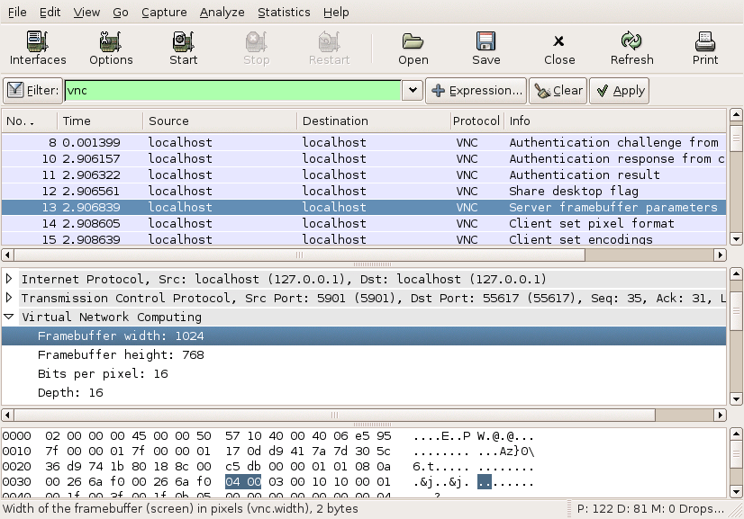

# Virtual Network Computing (VNC)

To quote the TightVNC page: "With TightVNC, you can see the desktop of a remote machine and control it with your local mouse and keyboard, just like you would do it sitting in the front of that computer." There are other similar technologies like the [X11](/X11) protocol, Laplink, ...

The real advantage of VNC is that it's implemented on multiple platforms. It's even possible to control the desktop of a Sun workstation by a WinCE PDA\!

The disadvantage of VNC, compared against other similar technologies, that it's sometimes a bit slower and that it doesn't allow files to be transferred.

VNC uses RFB, the "Remote Frame Buffer" protocol, for the actual data transfer.

## History

VNC was developed by Olivetti Research Ltd / AT\&T Labs Cambridge which made it available to the public in 1998. In 2002 they've founded a company called [RealVNC](http://www.realvnc.com/) which is doing further work on it. As the protocol itself is open, there are some other implementations around now: TightVNC, Ultr@VNC, ...

## Protocol dependencies

  - [TCP](/TCP): Typically, VNC uses [TCP](/TCP) as its transport protocol. The are some well known TCP ports for VNC traffic: 580x and 590x, the x must be replaced by the number of the virtual desktop. The 580X port is used as an [HTTP](/HTTP) server that serves a Java applet client.

## Example traffic



## Wireshark

The VNC dissector is almost entirely functional for the RealVNC protocol, lacking only the ability to dissect some ZRLE subencoding messages.

## Preference Settings

(XXX add links to preference settings affecting how VNC is dissected).

## Example capture file

[SampleCaptures/vnc-sample.pcap](uploads/__moin_import__/attachments/SampleCaptures/vnc-sample.pcap)

## Display Filter

A complete list of VNC display filter fields can be found in the [display filter reference](http://www.wireshark.org/docs/dfref/v/vnc.html)

Show only the VNC based traffic:

``` 
 vnc 
```

## Capture Filter

You cannot directly filter VNC protocols while capturing. However, if you know the [TCP](/TCP) port used (see above), you can filter on that one.

Capture only the VNC traffic over the default port (e.g. 5901):

``` 
 tcp port 5901 
```

## External links

  - [RealVNC](http://www.realvnc.com/) the creators of VNC

  - [TightVNC](http://www.tightvnc.com/) GPL implementation of VNC (compatible with RealVNC)

  - [Ultr@VNC](http://ultravnc.sourceforge.net/) another implementation

  - [The RFB Protocol](http://www.realvnc.com/docs/rfbproto.pdf) Protocol description of the "Remote Frame Buffer" protocol

## Discussion

---

Imported from https://wiki.wireshark.org/VNC on 2020-08-11 23:27:11 UTC
