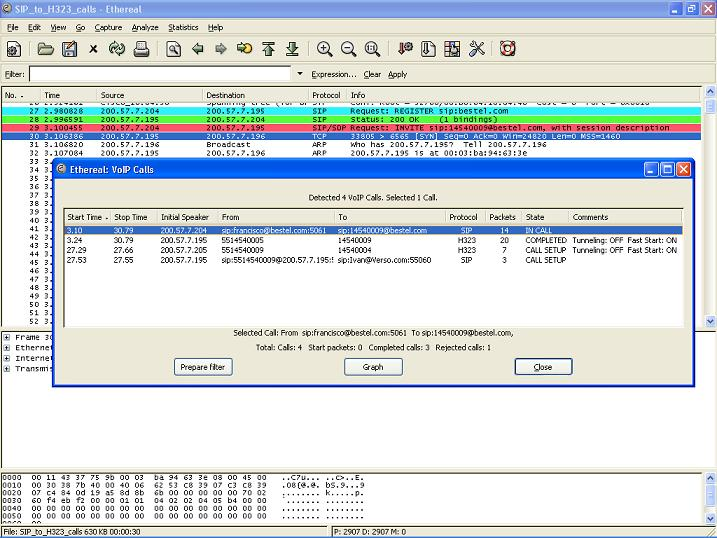
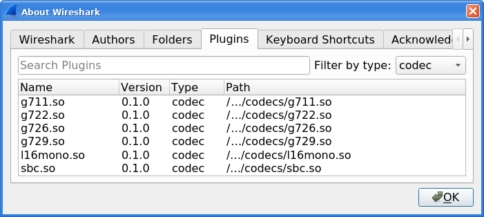
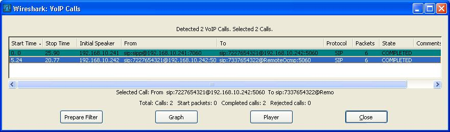
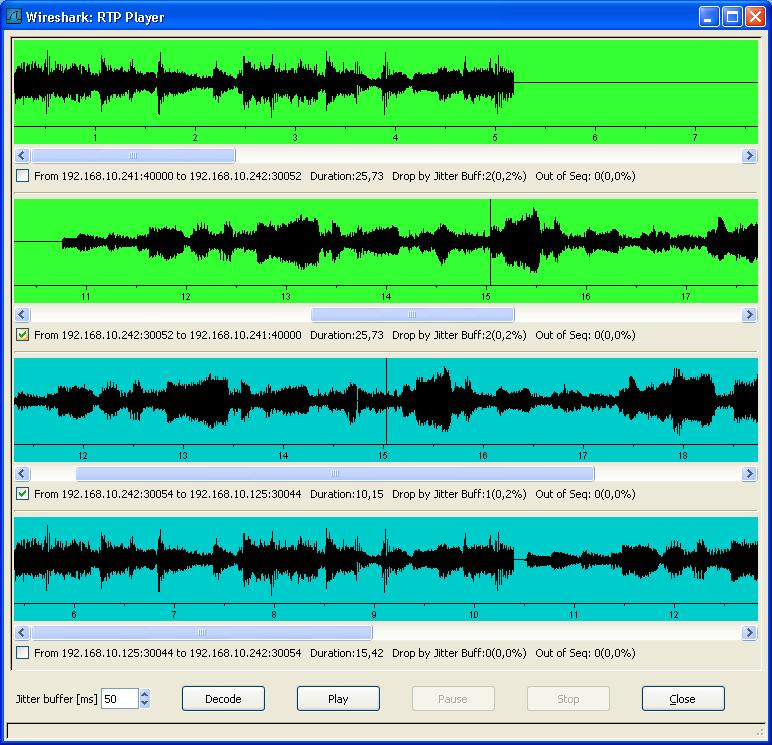

# VoIP Calls

Lea esta ayuda en español en [http://wiki.wireshark.org/VoIP\_calls\_spanish](/VoIP_calls_spanish)

To access the VoIP calls analysis use the menu entry "Telephony-\>VoIP Calls...". The current VoIP supported protocols are:

  - [SIP](/SIP)

  - [H323](/H323)

  - [ISUP](/ISUP)

  - [MGCP](/MGCP)

  - [UNISTIM](/UNISTIM)

with the corresponding [RTP](/RTP) streams.

See [VOIPProtocolFamily](/VOIPProtocolFamily) for an overview of the used VoIP protocols.

To try out this dialog, a small capture file containing a VoIP call can be found at [SampleCaptures/rtp\_example.raw.gz](uploads/__moin_import__/attachments/SampleCaptures/rtp_example.raw.gz) which contains an example [H323](/H323) call including [H225](/H225), [H245](/H245), [RTP](/RTP) and [RTCP](/RTCP) packets.

## List VoIP calls

The VoIP calls list shows the following information per call:

  - Start Time: Start time of the call.

  - Stop Time: Stop time of the call.

  - Initial Speaker: The IP source of the packet that initiated the call.

  - From: For [H323](/H323) and [ISUP](/ISUP) calls, this is the calling number. For [SIP](/SIP) calls, it is the "From" field of the INVITE. For [MGCP](/MGCP) calls, the EndpointID or calling number. For [UNISTIM](/UNISTIM) the Terminal ID.

  - To: For [H323](/H323) and [ISUP](/ISUP) calls, this is the called number. For [SIP](/SIP) calls, it is the "To" field of the INVITE. For [MGCP](/MGCP) calls, the EndpointID or dialed number. For [UNISTIM](/UNISTIM) the dialed number.

  - Protocol: Any of the protocols listed above

  - Packets: Number of packets involved in the call.

  - State: The current call state. The possible values are
    
      - CALL SETUP: call in setup state (Setup, Proceeding, Progress or Alerting)
    
      - RINGING: call ringing (only supported for [MGCP](/MGCP) calls)
    
      - IN CALL: call is still connected
    
      - CANCELLED: call was released before connect from the originated caller
    
      - COMPLETED: call was connected and then released
    
      - REJECTED: call was released before connect by the destination side
    
      - UNKNOWN: call in unknown state

  - Comment: An additional comment, this is protocol dependent. For [H323](/H323) calls it shows if the call uses Fast Start or/and [H245](/H245) Tunneling.

### Filtering a call

To prepare a filter for a particular call, just select the desired call and press "Prepare Filter" button. This will create a filter in the Main Wireshark windows to filter the packets related to this call. This is specially useful when you want to connect [ISUP](/ISUP) calls according to some CIC value.

## VoIP calls Graph analysis

To Graph analysis one or multiple calls from the VoIP List, select them from the list and then press the "Graph" button.

The Graph will show the following information:

  - Up to Ten columns representing an IP address each one.

  - All packets that belong to the same call are colorized with the same color

  - An arrow showing the direction of each packet in the calls

  - The label on top of the arrow shows message type. When available, it also shows the media codec.

  - The [RTP](/RTP) traffic is summarized in a wider arrow with the corresponded Codec.

  - Shows the [UDP](/UDP)/[TCP](/TCP) source and destination port per packet.

  - The comment column has protocol dependent information:
    
      - [H323](/H323):
        
          - Fast Start and [H245](/H245) Tunneling ON/OFF for the packet.
        
          - The SETUP message shows the calling and called number
        
          - The RELEASE message shows the [Q.931](/Q.931) Release cause code
    
      - [SIP](/SIP):
        
          - Shows if the packet is a "Request" or a "Staus" message.
          - The INVITE message also shows the "From" and "To" fields
    
      - [ISUP](/ISUP):
        
          - The format is as follows: NetworkID-Originating Point Code -\> NetworkID-Destination Point Code, CIC
    
      - [MGCP](/MGCP):
        
          - The MGCP Endpoint ID, and if the packet is a "Request" or "Response" message.
    
      - [UNISTIM](/UNISTIM):
        
          - Details of the message, and the sequence \#.
    
      - [RTP](/RTP):
        
          - Number of RTP packets in the stream, the duration in seconds and the SSRC field.

When clicking a packet in the Graph, the selected frame will be selected in the Main Wireshark window.

## Playing VoIP calls

Wireshark allows you to play any codec supported by an installed plugin. Wireshark allows you to save decoded audio in .au file format. Prior to version 3.2.0, it only supported saving audio using the G.711 codec; from 3.2.0 it supports saving audio using any codec with 8000 Hz sampling.

The codecs supported by Wireshark depend on the version of Wireshark you're using. The official builds contain all of the plugins maintained by the Wireshark developers, but custom/distribution builds might not include some of those codecs. To check your Wireshark follow this procedure:

  - open Help -\> About Wireshark window

  - switch to *Plugins tab*

  - select *codec* as *Filter by type*

To play the RTP audio stream of one or multiple calls from the VoIP List, select them from the list and then press the "Player" button:

Choose an initial value for the jitter buffer and then press the "Decode button". The jitter buffer emulated by Wireshark is a fixed size jitter buffer and can efficiently be used to reproduce what clients can effectively hear during the VoIP call.

You can now see all RTP streams available for the calls that you selected:

Note that all RTP packets that are dropped because of the jitter buffer are reported ("Drop by Jitter Buff"), as well as the packets that are out of sequence (Out of Seq).

Pressing the "Play" button plays the RTP stream from within Wireshark. A progress bar indicates the position in the stream and is synchronized amongst all RTP streams that are played.

## Discussion

The file rtp\_example.raw.gz didn't worked for me, you may try to play this capture file VoIP call instead: [SampleCaptures/SIP\_CALL\_RTP\_G711](uploads/__moin_import__/attachments/SampleCaptures/SIP_CALL_RTP_G711)

I have [some videos on how to analyze VoIP calls using Wireshark](http://www.jasongarland.com/wireshark/).

---

Imported from https://wiki.wireshark.org/VoIP_calls on 2020-08-11 23:27:13 UTC
