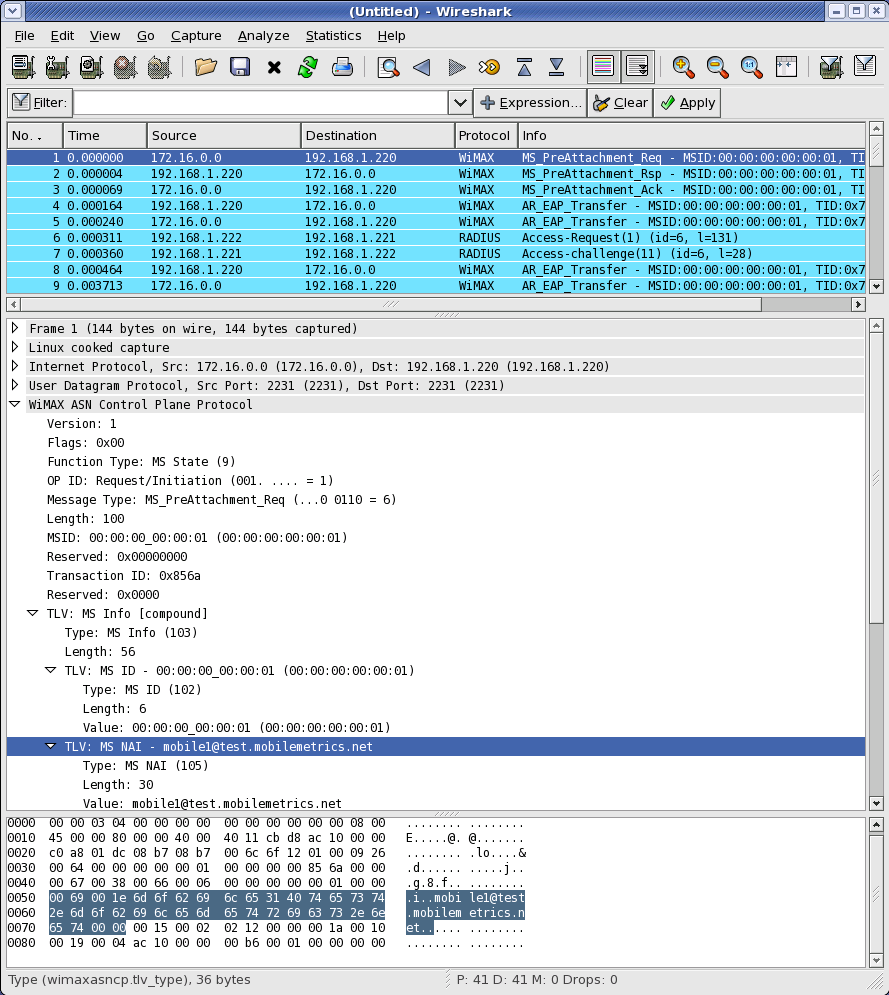

# WiMAX ASN Control Protocol (WIMAXASNCP)

## History

## Protocol dependencies

  - [UDP](/UDP): WIMAXASNCP uses UDP as its transport protocol. The well known UDP port for WIMAXASNCP traffic is 2231.

## Example traffic



## Wireshark

The WIMAXASNCP dissector is based on the WiMAX Forum Network Architecture (Stage 3: Detailed Protocols and Procedures), Release 1.0.0, March 28, 2007 specification and is mostly functional. Some TLVs are not fully decoded, but if the type is known to the dissector, the displayed value will default to hex.

### WiMAX Spec Deltas

#### Message Type Decoding

The spec defines the message types MS\_Attachment\_Req, MS\_Attachment\_Rsp, and MS\_Attachment\_Ack as having the function type Data Path Control:

| WiMAX Forum Network Architecture |
| -------------------------------- |
| Function: Data Path Control (3)  |
| MS\_Attachment\_Req (13)         |
| MS\_Attachment\_Rsp (14)         |
| MS\_Attachment\_Ack (15)         |

The plugin additionally recognizes the message types MS\_Attachment\_Req, MS\_Attachment\_Rsp, and MS\_Attachment\_Ack as having the function type MS State:

| Wireshark WIMAXASNCP Plugin                  |
| -------------------------------------------- |
| Function: MS State (9)                       |
| MS\_[PreAttachment](/PreAttachment)\_Req (6) |
| MS\_[PreAttachment](/PreAttachment)\_Rsp (7) |
| MS\_[PreAttachment](/PreAttachment)\_Ack (8) |

Furthermore, the dissector recognizes the function type Session. The additional message types are as follows:

| Wireshark WIMAXASNCP Plugin |
| --------------------------- |
| Function: Session (11)      |
| Session\_Release\_Req (1)   |
| Session\_Release\_Rsp (2)   |
| Session\_Release\_Ack (3)   |
| Session\_Failure\_Rpt (4)   |
| Session\_Failure\_Rsp (5)   |

#### Additional TLVs

The WIMAXASNCP dissector recognizes the following additional TLVs.

| Type | Name                    | Value                    |
| ---- | ----------------------- | ------------------------ |
| 1136 | Control Plane Indicator | 0 = Success, 1 = Failure |
| 1228 | IM Auth Indication      | 0 = Success, 1 = Failure |

### Limitations

#### 802.16e-2005 Related TLVs

The dissector is currently unable to decode, beyond the default hex dump, the 802.16e-2005 related TLVs. For reference, they are as follows:

| Type | Name                        | Notes                                                                                            |
| ---- | --------------------------- | ------------------------------------------------------------------------------------------------ |
| 49   | DCD Setting                 | Compound, as specified in \[802.16e-2005\], section 11.1.7.                                      |
| 72   | Full DCD Setting            | Compound, as specified in \[802.16e-2005\], section 11.1.7.                                      |
| 73   | Full UCD Setting            | Compound, as specified in \[802.16e-2005\], section 11.1.7.                                      |
| 195  | UCD Setting                 | Compound, as specified in \[802.16e-2005\], section 11.1.7.                                      |
| 74   | Global Service Class Change | Global Service Class Name as defined in IEEE802.16e.                                             |
| 81   | IDLE Mode Retain Info       | Encoded as in 802.16e.                                                                           |
| 118  | Paging Cycle                | Cycle in which the paging message is transmitted within the paging group (aligned with 802.16e). |
| 169  | SAID                        | SAID definition as per 802.16.                                                                   |

#### Unclearly Defined TLVs

These TLVs are not clearly defined by the spec and are decoded as a hex dump.

| Type | Name                          | Notes |
| ---- | ----------------------------- | ----- |
| 41   | Data Integrity Info           | No length, value, or description. |
| 78   | HO Process Optimization       | Value: 8-bit integer representing HO Process Optimization code, but no description. |
| 104  | MS Mobility Mode              | Numeric base is not defined. Values are given as 00, 01, 10, 11. I presume this is binary, but other TLVs clearly define binary (e.g. 0b11) or hex (0x11). |
| 167  | R3 Operation Status           | Numeric base is not defined. See description above. |
| 121  | Paging Start/Stop             | Length is defined as 1, but no values are provided. |
| 122  | PC Relocation Indication      | Length is defined as 1, but no values are provided. |
| 148  | Relocation Response           | Values defined as boolean, but boolean not defined in the spec. Two other boolean TLVs exist, but they differ on the definition of success and failure. See Anchor PC Relocation Request Response (14) which defines 0xFF for accept and 0x00 for refuse, and LU Result Indicator (90) which defines 0 as success and 1 as failure. |
| 149  | Relocation Success Indication | Values defined as boolean, but boolean not defined in the spec. See description above.|
| 155  | ROHC/ECRTP Context ID         | Length, value described as TBD.|
| 181  | Service Authorization Code    | No length, value, or description. |


These TLVs are not clearly defined by the spec, but some attempt has been made to decode them.

| Type   | Name                            | Notes | Dissector Behavior |
| ------ | ------------------------------- | ----- | ------------------ |
| 82     | IP Destination Address and Mask | Ambiguous. The length in octets is described as Nx8 (IPv4) or Nx32 (IPv6), but this function cannot always differentiate between IPv4 and IPv6. For example, if length = 32, then is it IPv4 where N=4 (4x8) or IPv6 where N=1 (1x32)? | Presume lengths that \*can\* indicate an IPv6 address and mask list \*do\* denote an IPv6 address and mask list. |
| 84     | IP Source Address and Mask      | Ambiguous. See description above. | Same as above.                                                                                                   |
| 0xFFFF | Vendor Specific TLV             | The format of the vendor specific information field (VSIF) is not clearly defined. It appears to be compound as the spec states that the vendor ID field shall be the first TLV embedded inside the VSIF. However, the vendor ID is shown as a 24-bit value. Does this mean the field is 24-bits? If so, how is alignment/padding handled? | Decodes the vendor ID as a non-padded 24-bit value and dumps the rest as hex.                                    |

#### Other TLVs

The following TLVs simply haven't been implemented yet. All should be reasonably straightforward to dissect, except possibly the EAP payload.

| Type | Name                               | Notes                                             |
| ---- | ---------------------------------- | ------------------------------------------------- |
| 48   | DCD/UCD Configuration Change Count |                                                   |
| 60   | DL PHY Quality Info                |                                                   |
| 61   | DL PHY Service Level               | Display in hex or decimal (or other)?             |
| 62   | EAP Payload                        | Hard? Might be able to borrow the RADIUS version. |
| 85   | IP TOS/DSCP Range and Mask         |                                                   |
| 94   | Media Flow Type                    |                                                   |
| 174  | SBC Context                        |                                                   |
| 197  | UL PHY Quality Info                |                                                   |
| 198  | UL PHY Service Level               | Display in hex or decimal (or other)?             |

## Preference Settings

(XXX add links to preference settings affecting how PROTO is dissected).

## Example capture file

## Display Filter

A complete list of WIMAXASNCP display filter fields can be found in the [display filter reference](http://www.wireshark.org/docs/dfref/protofirstletter/proto.html)

Show only the WIMAXASNCP based traffic:

``` 
 wimaxasncp 
```

## Capture Filter

You cannot directly filter WIMAXASNCP protocols while capturing. However, if you know the [UDP](/UDP) port used (see above), you can filter on that one.

Capture only the WIMAXASNCP traffic over the default port (2231):

``` 
 udp port 2231 
```

## External links

  - WiMAX Forum <http://wimaxforum.org>

## Discussion

---

Imported from https://wiki.wireshark.org/WIMAXASNCP on 2020-08-11 23:27:26 UTC
