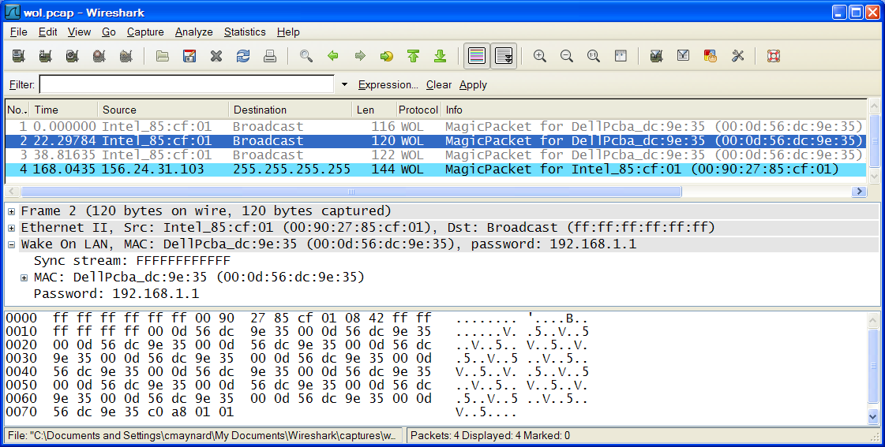

# WakeOnLAN (WOL)

WakeOnLAN is the protocol name given to the so-called Magic Packet technology, developed by AMD and Hewlett Packard for remotely waking up a remote host that may have been automatically powered-down because of its power management features. Although power management allows companies and individuals to cut power usage costs, it presents a problem for IT departments especially in being able to quickly and efficiently remotely manage PC's, especially during off-hours operation when those PC's are most likely to be in a suspended or standby state, assuming power management features are enabled.

## History

For a history of WakeOnLAN and Magic Packet technology, refer to either [this wikipedia article](http://en.wikipedia.org/wiki/Wake-on-LAN), or [read this AMD white paper](http://support.amd.com/TechDocs/20213.pdf).

## Protocol dependencies

  - [Ethernet](/Ethernet): According to AMD's white paper, WakeOnLAN depends only on Ethernet. However, the paper also indicates that the Magic Packet can reside anywhere within the payload. This means that we would have to search every Ethernet frame for the Magic Packet. In my opinion, doing so would degrade Wireshark performance, especially since most traffic will not contain a Magic Packet. Therefore, the WakeOnLAN dissector has been implemented to dissect only the actual implementations of the Magic Packet. As of this writing, the author is only aware of 2 implementations, one being [ether-wake](http://linux.die.net/man/8/ether-wake) which uses Ethertype 0x0842, which is unfortunately not yet a registered Ethertype, and the other implementation being over [UDP](/UDP).

  - [UDP](/UDP): Several tools mentioned in the above wikipedia article implement the Magic Packet over [UDP](/UDP).

## Packet Format

A physical WakeOnLAN (Magic Packet) will look like this:

<div>

<table>
<tbody>
<tr class="odd">
<td style="text-align: center;"><p><strong>Synchronization Stream</strong></p></td>
<td style="text-align: center;"><p><strong>Target MAC</strong></p></td>
<td style="text-align: center;"><p><strong>Password (optional)</strong></p></td>
</tr>
<tr class="even">
<td style="text-align: center;"><p>6</p></td>
<td style="text-align: center;"><p>96</p></td>
<td style="text-align: center;"><p>0, 4 or 6</p></td>
</tr>
</tbody>
</table>

</div>

The Synchronization Stream is defined as 6 bytes of FFh.

The Target MAC block contains 16 duplications of the [IEEE](http://www.ieee.org/portal/site) address of the target, with no breaks or interruptions.

The Password field is optional, but if present, contains either 4 bytes or 6 bytes. The WakeOnLAN dissector was implemented to dissect the password, if present, according to the command-line format that ether-wake uses, therefore, if a 4-byte password is present, it will be dissected as an IPv4 address and if a 6-byte password is present, it will be dissected as an Ethernet address.

## Example traffic

Here is a screenshot of some WakeOnLAN traffic:



## Wireshark

The WOL dissector is fully functional for Ethertype 0x0842 and for UDP only. It was first included with Wireshark starting with Git commit 6785ffd7965535af8f69ad2b1eea985186190795 on November 6, 2007. General availability began with the [0.99.7](http://www.wireshark.org/docs/relnotes/wireshark-0.99.7.html) release of Wireshark.

## Preference Settings

Currently, there are no preferences for the WOL dissector; however, in some cases you may need to ensure that the UDP "*Try heuristic sub-dissectors first*" preference is enabled in order for WOL dissection to work. When enabling this UDP preference, keep in mind that heuristics are not fool-proof, so it's possible that enabling it could adversely affect dissection of other protocols. Enable it with caution.

## Example capture file

A simple example capture file containing WOL traffic is available on the [SampleCaptures](/SampleCaptures) page.

  - [SampleCaptures/wol.pcap](uploads/__moin_import__/attachments/SampleCaptures/wol.pcap)

## Display Filter

A complete list of WOL display filter fields can be found in the [display filter reference](http://www.wireshark.org/docs/dfref/w/wol.html)

Example: Show only the WOL based traffic:

``` 
 wol
```

## Capture Filter

As WOL is currently implemented, you can use the following capture filter to be reasonably assured of capturing most WOL traffic; however, to guarantee all WOL traffic is captured, at least as far as the dissector is concerned, you should omit the "port 9" qualifier in the capture filter expression:

``` 
 ether proto 0x0842 or udp port 9
```

## External links

  - More information about WakeOnLAN can be found on [wikipedia](http://en.wikipedia.org/wiki/Wake-on-LAN).

  - The [AMD white paper](http://support.amd.com/TechDocs/20213.pdf) is also an excellent source of information.

## Discussion

---

Imported from https://wiki.wireshark.org/WakeOnLAN on 2020-08-11 23:27:16 UTC
