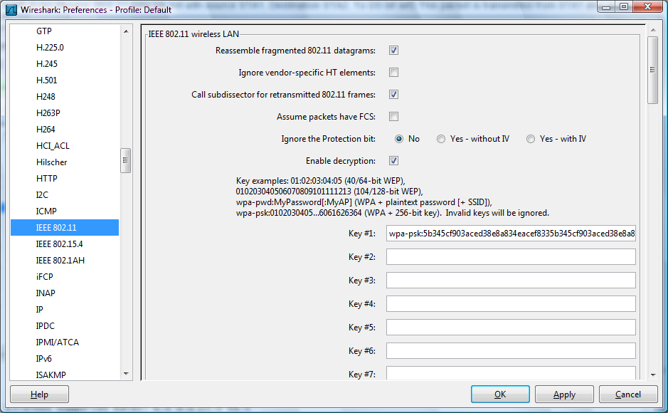
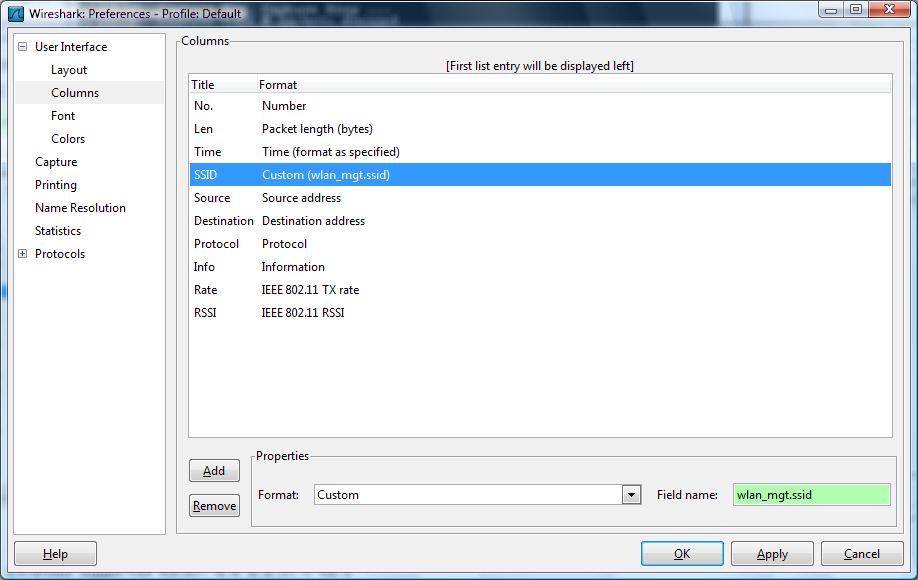

# Wi-Fi (WLAN, IEEE 802.11)

Wi-Fi, or IEEE 802.11, is the standard for wireless LANs, or WLANs. The abbreviation Wi-Fi stands for Wireless Fidelity, and resembles the Hi-Fi acronym. It represents a whole collection of protocols within the same family of Ethernet and Token Ring.

It is specified by [various IEEE 802.11 specifications](http://standards.ieee.org/getieee802/802.11.html).

IEEE 802.11 sends network packets from the sending host to one ([Unicast](/Unicast)) or more ([Multicast](/Multicast)/[Broadcast](/Broadcast)) receiving hosts.

The 802.11 protocols specify a wireless shared network, which means that the maximum bandwidth is only available to one user at a time.

:warning: **See the [CaptureSetup/WLAN](/CaptureSetup/WLAN) page for instructions how to capture from WLAN's (including monitor mode), and see the [CaptureSetup](/CaptureSetup) page for general information on capturing on WLAN's and other media.**

## 802.11 Standards

The basic 802.11 standards are:

  - 802.11 (2MBit/s 2.4GHz) First generation of WLAN equipment; allows 1 and 2 Mbps.
  - 802.11b (11MBit/s 2.4GHz) Second generation of WLAN equipment, and the first generation to receive widespread use; allows 1, 2, 5.5 and 11 Mbps.
  - 802.11a (54MBit/s 5GHz)
  - 802.11g (54MBit/s 2.4GHz)
  - 802.11n Enhancements for Higher Throughput

Some additional 802.11 standards are:

  - 802.11i (Security WPA1 and WPA2) No change to data rate. Improvement in security.
  - 802.11h (Spectrum and Transmit Power Management)
  - 802.11e (Quality of service, packet busting)
  - 802.11d International (country-to-country) roaming extensions
  - 802.11f Inter-Access Point Protocol (IAPP)
  - 802.11j Extensions for Japan

## History

XXX - add a brief description of 802.11 history

## 802.11 vs. "fake Ethernet" captures

When capturing with Wireshark (or other tools using libpcap/WinPcap, such as [TcpDump](/TcpDump) / [WinDump](/WinDump)) there are two ways in which 802.11 can be supplied by the system and stored in a capture file:

  - "real" 802.11: the hardware/driver provides the actual protocol data that travels over the air, complete with 802.11 headers. (There are variants of this in which "radio information" such as signal strength can be provided as well.)
  - "fake" Ethernet: the hardware/driver translates the 802.11 headers into Ethernet headers so that the whole packet looks like a normal Ethernet packet. If the hardware/driver is doing this, all 802.11-specific management and control frames are usually discarded, as there's no equivalent to them in Ethernet (although some drivers might use a non-standard way of making them look like Ethernet packets, such as using a special Ethernet packet type).

Detailed information about how to capture 802.11 traffic can be found at the [CaptureSetup/WLAN](/CaptureSetup/WLAN) page.

## Protocol dependencies

  - 802.11 is the lowest software layer, so it only depends on hardware.

## Example traffic

<span class="u">One ICMP Ping Request and response session from Station(STA1 to station(STA2) via Access point(AP)</span>  
*ICMP ECHO request*  

  - ICMP Echo request (802.11 data packet with source STA1, Destination STA2, To DS bit set) This packet is transmitted from STA1 and received by AP  

  - ACK(802.11 control packet, dest STA1) This packet is transmitted by AP and recieved by STA1  

  - ICMP Echo request (802.11 data packet with source STA1, Destination STA2, From DS bit set) This packet is transmitted by AP and received by STA2.  

  - ACK(802.11 control packet Dest AP) This packet is sent to AP by STA2 to acknowledge reciept of the Echo request packet.

*ICMP ECHO Response*  

  - ICMP Echo response(802.11 data packet with source STA2, Destination STA1, To DS bit set) This packet is transmitted from STA2 and received by AP  

  - ACK(802.11 control packet, dest STA2) This packet is transmitted by AP and recieved by STA2  

  - ICMP Echo response (802.11 data packet with source STA2, Destination STA1, From DS bit set) This packet is transmitted by AP and received by STA1.  

  - ACK (802.11 control packet Dest AP) This packet is sent to AP by STA1 to acknowledge reciept of the Echo response packet.

XXX - Add example traffic here (as Wireshark screenshot).

## Wireshark

The 802.11 dissector is fully functional. It supports WEP and WPA/WPA2 decryption (see [HowToDecrypt802.11](/HowToDecrypt802.11) for details) and 802.11n.

Capturing 802.11 traffic can be tricky, see [CaptureSetup](/CaptureSetup) page for instructions how to capture from WLAN's (including monitor mode) and other media.

## Preference Settings

802.11 is a complex protocol and Wireshark has a variety of 802.11-related preferences as a result.



The reassembly and retransmission settings can affect the way that higher-layer information is dissected and displayed. The FCS and Protection bit settings can affect how frames are decrypted. For detailed information about the decryption settings, see [HowToDecrypt802.11](/HowToDecrypt802.11).

You can also add 802.11-specific information to the packet list.



## Example capture file

[SampleCaptures/Network\_Join\_Nokia\_Mobile.pcap](uploads/__moin_import__/attachments/SampleCaptures/Network_Join_Nokia_Mobile.pcap)

## Display Filter

A complete list of 802.11 display filter fields can be found in the [wlan](http://www.wireshark.org/docs/dfref/w/wlan.html), [wlan\_mgt](http://www.wireshark.org/docs/dfref/w/wlan_mgt.html), and [wlan\_aggregate](http://www.wireshark.org/docs/dfref/w/wlan_aggregate.html) display filter references.

Show only the 802.11-based traffic:

``` 
 wlan
```

Show only the 802.11-based traffic to and from 802.11 MAC address 08:00:08:15:ca:fe:

``` 
 wlan.addr==08.00.08.15.ca.fe
```

Hide beacon frames:

``` 
 wlan.fc.type_subtype != 0x08
```

Show management frames for a specific SSID:

``` 
 wlan_mgt.ssid == "Spatula City"
```

## Capture Filter

Newer versions of libpcap support raw 802.11 headers via the "wlan" link type. Older versions must use "ether" or "link" via fake Ethernet headers, and might not support 802.11 capture at all.

  - Capture only the 802.11-based traffic to and from 802.11 MAC address 08:00:08:15:ca:fe:
    
    ``` 
     wlan host 08:00:08:15:ca:fe
    ```

  - Filter out beacon frames:
    
    ``` 
     wlan[0] != 0x80
    ```

See CaptureSetup/WLAN page for instructions on how to capture from WLANs (including monitor mode).

## External links

  - [802.11 Alphabet Soup](http://www.wi-fiplanet.com/tutorials/article.php/1439551) a tutorial of the various 802.11 letters. Dated August 05, 2002.

## Discussion

---

Imported from https://wiki.wireshark.org/Wi-Fi on 2020-08-11 23:27:26 UTC
