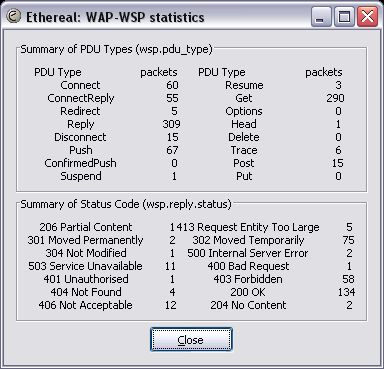

# Wireless Session Protocol (WSP)

The Wireless Session Protocol offers the [HTTP](/HTTP) request-response paradigm, and in addition it offers a new service named Wap Push, allowing applications in the network to push (unsolicited) data to a push-enabled application on the mobile device.

The Wireless Session Protocol started with the knowledge that many header names and values in the [Hyper\_Text\_Transfer\_Protocol](/Hyper_Text_Transfer_Protocol) are fixed strings. With efficient over-the-air usage of the bandwidth in mind, WSP attempts at encoding these fixed strings in a compact binary manner. This way, the header cache-control: no-cache can be encoded in 2 bytes: one for the header name (cache-control) and one for its value (no-cache).

There are 2 types of WSP:

  - **Connectionless WSP (CL-WSP)** only offers unreliable transport of WSP primitives, both pull (request and response) and push (single message).

  - **Conection-oriented WSP (CO-WSP)** offers the same services as CL-WSP, extended with connection (session) management, session capability negotiation, larger data transfer (segmentation and reassembly) and reliable data transport (acknowledgement mechanism).

On a protocol level, CO-WSP relies upon [WTP](/WTP) for the added functionality. With CL-WSP, the [WTP](/WTP) layer is reduced to a one-byte transaction identifier, which is part of WSP as the 1st byte. This way it is still possible in WTP to match a response with a request (same WSP transaction identifier).

:warning: The word "connection" in *connection-oriented WSP* has nothing to do with the actual *bearer connection*. In fact CO-WSP might be seen as a more stateful and elaborate version of CL-WSP, where the latter provides only basic functionality.

## History

In the early days of mobile Internet (access to Internet-like network services with a handheld device on a wireless network), it was already understood that bandwidth was a costly resource, and that round-trips were typically significantly longer than on classic computer networks. Both yielded an efficient protocol family created at the WAP Forum. The WAP Forum defined a protocol family for enabling Internet-like and Internet-based serviced to be accessible on mobile devices with limited capabilities and resources, being part of a wireless network.

One of the goals of the WAP Forum was to define a set of protocols which could offer [Hyper\_Text\_Transfer\_Protocol](/Hyper_Text_Transfer_Protocol) like transport in a more efficient manner. This resulted in the Wireless Session Protocol (WSP).

## Protocol dependencies

The WAP transport protocol stack is shown below:


Depending on the protocol stack, 4 different standard [WDP](/WDP) ([UDP](/UDP)) ports have been defined: 9200, 9201, 9202 and 9203. WSP can run on other ports too.

  - [WDP](/WDP): On non-IP bearers, WSP uses [WDP](/WDP) as its transport protocol.

  - [UDP](/UDP): On IP-enabled bearers (such as GPRS and GSM CSD) WSP uses [UDP](/UDP) as its transport protocol.

  - [WTLS](/WTLS): If the bearer does not provide security, WSP often uses [WTLS](/WTLS) for over-the-air encryption to prevent eavesdropping.

  - [WTP](/WTP): When [WTP](/WTP) is used, we're talking about Connection-Oriented WSP (CO-WSP), where [WTP](/WTP) provides WSP connection (session) management, session capability negotiation, larger data transfer (segmentation and reassembly, WTP SAR) and reliable data transport (acknowledgement mechanism).

## Example traffic

    No.     Time        Source                Destination           Protocol
        669 193.049760  10.0.1.5              10.0.1.204            SMPP
    
    Info
    WSP Push (0x06) (WBXML 1.2, Public ID: "-//WAPFORUM//DTD SI 1.0//EN (Service Indication 1.0)")
    
    
    Frame 669 (191 bytes on wire, 191 bytes captured)
        Arrival Time: Jan  7, 2005 11:11:29.444839000
        Time delta from previous packet: 193.049760000 seconds
        Time since reference or first frame: 193.049760000 seconds
        Frame Number: 669
        Packet Length: 191 bytes
        Capture Length: 191 bytes
    Ethernet II, Src: 00:0b:cd:31:a1:2b, Dst: 00:40:f4:61:36:52
        Destination: 00:40:f4:61:36:52 (CameoCom_61:36:52)
        Source: 00:0b:cd:31:a1:2b (CompaqHp_31:a1:2b)
        Type: IP (0x0800)
    Internet Protocol, Src Addr: 10.0.1.5 (10.0.1.5), Dst Addr: 10.0.1.204 (10.0.1.204)
        Version: 4
        Header length: 20 bytes
        Differentiated Services Field: 0x00 (DSCP 0x00: Default; ECN: 0x00)
            0000 00.. = Differentiated Services Codepoint: Default (0x00)
            .... ..0. = ECN-Capable Transport (ECT): 0
            .... ...0 = ECN-CE: 0
        Total Length: 177
        Identification: 0x01a1 (417)
        Flags: 0x04 (Don't Fragment)
            0... = Reserved bit: Not set
            .1.. = Don't fragment: Set
            ..0. = More fragments: Not set
        Fragment offset: 0
        Time to live: 128
        Protocol: TCP (0x06)
        Header checksum: 0xe1d5 (correct)
        Source: 10.0.1.5 (10.0.1.5)
        Destination: 10.0.1.204 (10.0.1.204)
    Transmission Control Protocol, Src Port: 1054 (1054), Dst Port: 10001 (10001),
     Seq: 48, Ack: 48, Len: 137
        Source port: 1054 (1054)
        Destination port: 10001 (10001)
        Sequence number: 48    (relative sequence number)
        Next sequence number: 185    (relative sequence number)
        Acknowledgement number: 48    (relative ack number)
        Header length: 20 bytes
        Flags: 0x0018 (PSH, ACK)
            0... .... = Congestion Window Reduced (CWR): Not set
            .0.. .... = ECN-Echo: Not set
            ..0. .... = Urgent: Not set
            ...1 .... = Acknowledgment: Set
            .... 1... = Push: Set
            .... .0.. = Reset: Not set
            .... ..0. = Syn: Not set
            .... ...0 = Fin: Not set
        Window size: 64081
        Checksum: 0x66e6 (correct)
    Short Message Peer to Peer, Command: Submit_sm, Seq: 19, Len: 137
        Length    : 137
        Operation : Submit_sm (0x00000004)
        Sequence #: 19
        Service type: (Default)
        Type of number (originator): Unknown (0x00)
        Numbering plan indicator (originator): ISDN (E163/E164) (0x01)
        Type of number (recipient): National (0x02)
        Numbering plan indicator (recipient): ISDN (E163/E164) (0x01)
        Recipient address: 0123456789
        .... ..00 = Messaging mode: Default SMSC mode (0x00)
        ..00 00.. = Message type  : Default message type (0x00)
        01.. .... = GSM features  : UDHI indicator (0x01)
        Protocol id.: 0x00
        Priority level: GSM: None      ANSI-136: Bulk         IS-95: Normal (0x00)
        Scheduled delivery time: Immediate delivery
        Validity period: SMSC default validity period
        .... ..00 = Delivery receipt  : No SMSC delivery receipt requested (0x00)
        .... 00.. = Message type      : No recipient SME acknowledgement requested (0x00)
        ...0 .... = Intermediate notif: No intermediate notification requested (0x00)
        .... ...0 = Replace           : Don't replace (0x00)
        Data coding: 0xf5
            SMPP Data Coding Scheme: Unknown (0xf5)
            GSM SMS Data Coding
            1111 .... = DCS Coding Group for SMS: SMS DCS: Data coding / message class (0x0f)
            .... 01.. = DCS Character set: 8-bit data (0x01)
            .... ..01 = DCS Message class: Class 1 - ME specific (0x01)
            GSM CBS Data Coding
            1111 .... = DCS Coding Group for CBS: SMS DCS: Data coding / message class (0x0f)
            .... 01.. = DCS Character set: 8-bit data (0x01)
            .... ..01 = DCS CBS Message class: Class 1 - User defined (0x01)
        Predefined message: 0
        Message length: 94
        Message
    GSM Short Message Service User Data
        UDH Length: 6
            IE Id: SMS - Application port addressing scheme, 16 bit address (0x05):
             source port 9200, destination port 2948
                Destination port: 2948
                Source port: 9200
    Wireless Session Protocol, Method: Push (0x06), Content-Type: application/vnd.wap.sic
        Transaction ID: 0xd0
        PDU Type: Push (0x06)
        Headers Length: 1
        Content-Type: application/vnd.wap.sic
    WAP Binary XML, Version: 1.2, Public ID: "-//WAPFORUM//DTD SI 1.0//EN (Service Indication 1.0)"
        Version: 1.2 (0x02)
        Public Identifier (known): -//WAPFORUM//DTD SI 1.0//EN (Service Indication 1.0) (0x00000005)
        Character Set: utf-8 (0x0000006a)
        String table: 0 bytes
        Data representation
            Level | State | Codepage | WBXML Token Description         | Rendering
                0 | Tag   | T   0    |   Known Tag 0x05           (.C) |  <si>
                1 | Tag   | T   0    |   Known Tag 0x06           (AC) |    <indication
                1 |  Attr | A   0    |   Known attrStart 0x0C          |      href='http://'
                1 |  Attr | A   0    | STR_I (Inline string)           |        'src.miel.com/imags/
                                                                                 wallpapers/xmas.jpg'
                1 |  Attr | A   0    |   Known attrStart 0x07          |      action='signal-medium'
                1 | Tag   | T   0    | END (attribute list)            |    >
                1 | Tag   | T   0    | STR_I (Inline string)           |    'Merry xmas !!!! JO JO JO'
                1 | Tag   | T   0    | END (Known Tag 0x06)            |    </indication>
                0 | Tag   | T   0    | END (Known Tag 0x05)            |  </si>

## Wireshark

The WSP dissector is fully functional, with the restriction that the Expect, Retry-After, Cookie and Set-Cookie headers are not yet decoded.

Wireshark also provides WSP statistics. Output looks like:



## Preference Settings

There are no preferences for WSP in Wireshark.

## Example capture file

[SampleCaptures/wap\_google.pcap](uploads/__moin_import__/attachments/SampleCaptures/wap_google.pcap)

## Display Filter

A complete list of WSP display filter fields can be found in the [display filter reference](http://www.wireshark.org/docs/dfref/w/wsp.html)

Show only the WSP based traffic:

``` 
 wsp 
```

## Capture Filter

You cannot directly filter WSP traffic while capturing. However, if you know the transport protocols used (see above), you can filter that way.

## External links

  - See the [WAP Forum](http://www.wapforum.org/) and the [Open Mobile Alliance](http://www.openmobilealliance.org).

## Discussion

---

Imported from https://wiki.wireshark.org/Wireless_Session_Protocol on 2020-08-11 23:27:34 UTC
