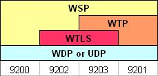

# Wireless Transaction Protocol (WTP)

The Wireless Transaction Protocol (WTP) is one of the protocols defined by the [WAP Forum](http://www.wapforum.org/) (now part of the [Open Mobile Alliance](http://www.openmobilealliance.org/)). WTP defines 3 classes of transactions: unreliable Invoke without Result (Class 0), reliable Invoke without Result (Class 1), and reliable Invoke with a reliable Result (Class 2).

In order to implement these transactions, 3 basic PDU types exist: Invoke, Result and Ack. Transactions of Class 0 and 1 are required when implementing WAP Push over [WSP](/WSP). Transactions of Class 2 can be compared with a normal [HTTP](/HTTP) transaction. The Invoke of a Class 2 transaction can either explicitly be acknowledged by an Ack PDU, or implicitly by the Result PDU; the Result PDU must always be explicitly acknowledged.

Different WTP packets that are part of the same transaction share the same Transaction Identifier (TID). This TID is a 16-bit identifier where the highest order bit indicates the direction. This bit is flipped whenever the transmission direction is inverted (client to server becoming server to client). This way it is possible for a connection to have multiple transactions pending. The TID can then be seen as a way of providing WTP transaction multiplexing. Note that both endpoints must support multiple outstanding transactions, and that this is typically negotiated at the [WSP](/WSP) level (maximum outstanding requests).

If a WTP Invoke or Result PDU spans multiple packets, then a mechanism called Segmentation And Reassembly (WTP SAR) can be used to split the payload over Segmented Invoke and Segmented Result PDUs. WTP SAR also defines a Negative Acknowledgement PDU type, which lists the WTP segments that did not reach the destination.

Each WTP fragment is identified with a 8-bit Packet Sequence Number (PSN), hence WTP SAR supports splitting the payload across up to 256 fragments. WTP fragments are transmitted in fragment groups consisting of a negotiated number of fragments. Once a group has been sent, the receiving endpoint issues a cumulative Ack for the entire group, or it issues a Negative Ack with the PSN of the missing fragment(s).

There also exists a so-called Extended WTP SAR, which allows a much higher maximum number of WTP message fragments.

An example WTP SAR transaction with a single invoke and 3 result segments is: Invoke, Result (PSN=0), Segmented Result (PSN=1), Segmented Result (PSN=2), Negative Ack (PSN=1), Segmented Result (PSN=1), Ack.

When WTP is used in conjunction with [WSP](/WSP), then the WAP specifications talk about Connection-Oriented [WSP](/WSP) (CO-WSP). absence of the WTP layer yields the so-called Connection-Less [WSP](/WSP) (CL-WSP) stack. Note that connection in this context has nothing to do with a physical connection, but only refers to extra functionality in [WSP](/WSP).

## History

The Wireless Transaction Protocol (WTP) initiated at the WAP Forum. The first specification dates from 1998. The only common use of WTP today is in conjunction with [WSP](/WSP).

## Protocol dependencies



Depending on the protocol stack, 4 different standard [WDP](/WDP) ([UDP](/UDP)) ports have been defined. When WTP is used, then the ports are 9201 (no bearer-level security) and 9203 (bearer-level security). The presence of WTP implies that the [WSP](/WSP) variant is CO-[WSP](/WSP). [WSP](/WSP) can run on other ports too.

  - [WTLS](/WTLS): WTP uses [WTLS](/WTLS) as its (optional) bearer-level security protocol. The well known [WDP](/WDP) ([UDP](/UDP)) port for secure connection-oriented [WSP](/WSP) (WSP over WTP over WTLS) is 9203.

  - [UDP](/UDP): WTP uses [UDP](/UDP) as its transport protocol over IP networks. The well known [WDP](/WDP) ([UDP](/UDP)) port for WTP traffic is 9201 for unsecure connection-oriented [WSP](/WSP) ([WSP](/WSP) over [WTP](/WTP)).

  - [WDP](/WDP): WTP uses [WDP](/WDP) as its transport protocol over non-[IP](/IP) networks (e.g., GSM SMS).

## Example traffic

XXX - Add example traffic here (as plain text or Wireshark screenshot).

## Wireshark

The WTP dissector is almost fully functional; not all TPIs are dissected, and Extended SAR neither.

## Preference Settings

(XXX add links to preference settings affecting how WTP is dissected).

## Example capture file

XXX - Add a simple example capture file. Keep it short, it's also a good idea to gzip it to make it even smaller, as Wireshark can open gzipped files automatically.

## Display Filter

A complete list of WTLS display filter fields can be found in the [display filter reference](http://www.wireshark.org/docs/dfref/w/wtp.html)

Show only the WTP based traffic:

``` 
 wtp 
```

## Capture Filter

You cannot directly filter WTP packets while capturing. However, if you know the transport bearer ([WDP](/WDP) ([UDP](/UDP)) port) used (see above), you can filter on that one.

## External links

  - The WTP specifications can be retrieved from the [OMA](http://www.openmobilealliance.org/) web site: <http://www.openmobilealliance.org/tech/affiliates/wap/wapindex.html>

---

Imported from https://wiki.wireshark.org/Wireless_Transaction_Protocol on 2020-08-11 23:27:34 UTC
