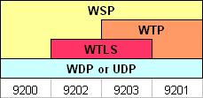

# Wireless Transport Layer Security (WTLS)

Wireless Transport Layer Service is an optional protocol which provides *bearer-level* security, in a way similar to [TLS](/TLS) for end-to-end security. If the wireless bearer already provides over-the-air security (to make eavesdropping more difficult by encrypting the data sent over the air), then WTLS is not required. This is the case for GSM CSD and GSM GPRS for example.

:warning: It is a common misconception that WTLS provides *end-to-end* security in WAP. This is **not true**. This "myth" probably originated in the way a secure [HTTP](/HTTP) connection is initiated by writing "<https://>" instead of "<http://>" in your web browser. The analogy was thougt to be the presence of WTLS. This issue is that between the [WSP](/WSP) client device and the [WAP](/WAP) Gateway, the URL is sent in cleartext and the HTTP response is sent back in cleartext to the device.

## History

XXX - add a brief description of WTLS history

## Protocol dependencies



Depending on the protocol stack, 4 different standard [WDP](/WDP) ([UDP](/UDP)) ports have been defined. When WTLS is used, then the ports are 9202 (CL-[WSP](/WSP)) and 9203 (CO-[WSP](/WSP)). [WSP](/WSP) can run on other ports too.

  - [WDP](/WDP): On non-IP bearers, WTLS uses [WDP](/WDP) as its transport protocol.

  - [UDP](/UDP): On IP-enabled bearers (such as GPRS and GSM CSD) WTLS uses [UDP](/UDP) as its transport protocol.

## Example traffic

XXX - Add example traffic here (as plain text or Wireshark screenshot).

## Wireshark

The WTLS dissector is fully functional. Decryption however is not provided yet.

## Preference Settings

There are no preferences for WTLS in Wireshark.

## Example capture file

XXX - Add a simple example capture file to the [SampleCaptures](/SampleCaptures) page and link from here. Keep it short, it's also a good idea to gzip it to make it even smaller, as Wireshark can open gzipped files automatically.

## Display Filter

A complete list of WTLS display filter fields can be found in the [display filter reference](http://www.wireshark.org/docs/dfref/w/wtls.html)

Show only the WTLS based traffic:

``` 
 wtls 
```

## Capture Filter

You cannot directly filter WTLS traffic while capturing. However, if you know the transport protocol (bearer) used (see above), you can filter on that one.

## External links

  - See the [WAP Forum](http://www.wapforum.org/) and the [Open Mobile Alliance](http://www.openmobilealliance.org).

## Discussion

---

Imported from https://wiki.wireshark.org/Wireless_Transport_Layer_Security on 2020-08-11 23:27:35 UTC
