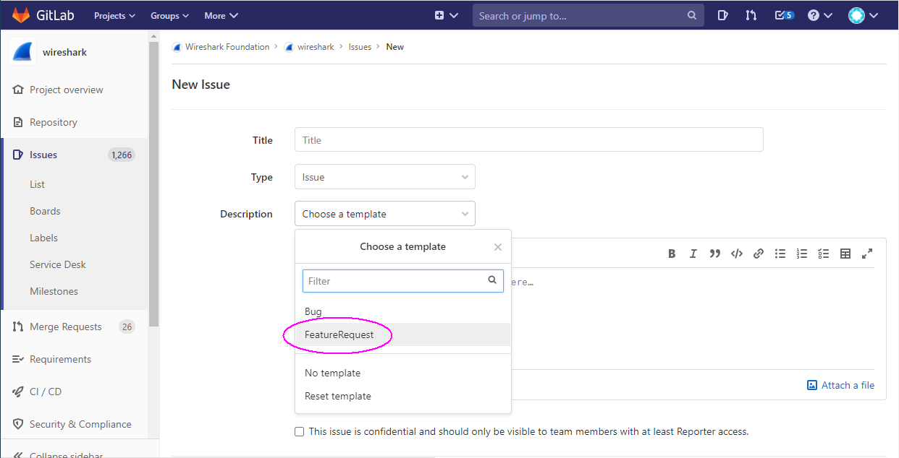

# Wireshark Wishlist

Enhancement requests can be added by opening a  at [Wireshark Issues](https://gitlab.com/wireshark/wireshark/-/issues) on GitLab.  
Follow the steps as if [Reporting a Bug](/ReportingBugs). Select the **FeatureRequest** template.  
  

---

Imported from https://wiki.wireshark.org/WishList on 2020-08-11 23:27:38 UTC
