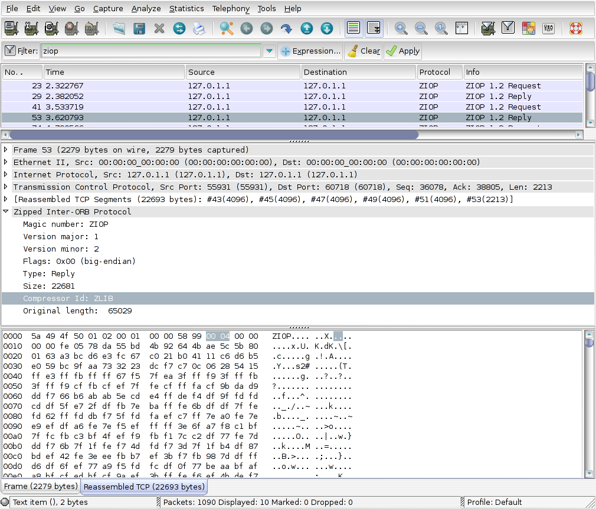

# Zipped Inter-ORB Protocol (ZIOP)

ZIOP - ZIOP is a new protocol which compresses GIOP Messages. Currently is a "OMG recommended for adoption" specification\[2\], that is, is under standarization by the hand of RemedyIT (TAO), TID (TIDorb) and IONA (Orbix).

## History

TODO

## Protocol dependencies

  - [TCP](/TCP): ZIOP is currently defined to use TCP as its transport protocol

## Example traffic

## Wireshark

The PROTO dissector is partially functional. It show compressed GIOP packets and all infomation about ZIOPHeader, compressor used, sizes, etc. But it doesn't decompress the compressed data.

## Preference Settings

There are no preference settings so far.

## Example capture file

<https://bugs.wireshark.org/bugzilla/attachment.cgi?id=2736>

## External links

  - [ZIOP](http://www.omg.org/cgi-bin/apps/doc?ptc/09-01-03.pdf) *ZIOP* - OMG ZIOP spec Beta 1

  - [Patch](https://bugs.wireshark.org/bugzilla/attachment.cgi?id=2786) *ZIOP Patch*- ZIOP patch for Wireshark

## Discussion

---

Imported from https://wiki.wireshark.org/ZIOP on 2020-08-11 23:27:53 UTC
