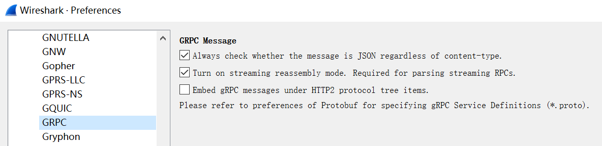

# gRPC

gRPC is an open source, high-performance remote procedure call (RPC) framework. For a description of gRPC refer to [gRPC home page](https://grpc.io/).

Change log about Wireshark supporting gRPC:
- Wireshark 2.6.0 - initial support.
- Wireshark 3.2.0 - supports parse Protobuf content of gRPC according to *.proto files. The message of stream gRPC method can now be parsed with supporting of HTTP2 streaming mode reassembly feature.
- Wireshark 3.3.0 - fixes bugs about parsing *.proto file. Adds some new Protobuf features, which can also be used for gRPC that serializes structured data using Protobuf.

>Note, the message body of gRPC is usually serialized in Protobuf format. So please also refer to [Protobuf page](/Protobuf) for the change log of Protobuf dissector.

## Protocol dependencies

- [HTTP2](/HTTP2): Typically, gRPC is carried over [HTTP/2](/HTTP2) framing. When the *content-type* header of HTTP2 is prefixed with *"application/grpc"*, it means that the body of HTTP2 is a gRPC message.
- JSON: If the message data of gRPC starts with '{' and ends with '}', then it means the body of gRPC message is JSON.
- [Protobuf](/Protobuf): Wireshark dissects the message data of gRPC as [Protobuf](/Protobuf) by default if there is no other registered message subdissector.

If there are other gRPC new message body dissectors other than JSON or Protobuf dissectors, or you want to override default gRPC message body dissectors of JSON or Protobuf, you can register your own message body subdissector in 'grpc_message_type' table via:

```c
    dissector_add_string("grpc_message_type", "application/grpc+xxx", xxx_handle);

    /* For example, we assume that the gRPC message of "application/grpc+xml" is XML. */
    dissector_handle_t  xml_handle = find_dissector("xml");
    dissector_add_string("grpc_message_type", "application/grpc+xml", xml_handle);
```

The pattern format used by 'grpc_message_type' table has two levels:
1. **Request/response level pattern**, which includes request
    *grpc-method-path* (equals to http2 *':path'* header value) and
    direction (request or response), the format is:\
    &nbsp;&nbsp;&nbsp;&nbsp;`http2-content-type "," http2-path "," direction`\
    &nbsp;&nbsp;&nbsp;&nbsp;`direction = "request" / "response"`,\
    for example:\
    &nbsp;&nbsp;&nbsp;&nbsp;`"application/grpc,/helloworld.Greeter/SayHello,request"`\
    The `http2-path` is usually composed of the service and the operation. In the example of above, the 'helloworld.Greeter' is the full path of service, and the 'SayHello' is the name of operation.

2. **Content-type level pattern**, which just takes *http2-content-type*
    as pattern (for example, `"application/grpc"`,
    `"application/grpc+proto"` or `"application/grpc+json"`).

gRPC dissector will try to call request/response message level subdissector first. If not found, then try content-type level dissectors. gRPC dissector will always transmit gRPC message information (http2-content-type "," http2-path "," direction ) to subdissector in `(void *data)` parameter of dissect handler. Content-type level subdissector can use this information to locate the request/response message type.

## An example about using gRPC dissector

We use an example to show how to use the gRPC dissector. This example relies on the example [Protobuf page](/Protobuf). It defines a gRPC service that supports querying user information based on user names.

### The example of gRPC service definition file

Following is an example of *.proto file, named `person_search_service.proto`, which relies on the `addressbook.proto` file defined in the example of [Protobuf page](/Protobuf):

```protobuf
// A gRPC service that searches for persons based on certain attributes.
syntax = "proto3";
package tutorial;
import "addressbook.proto";

message PersonSearchRequest {
  repeated string name = 1;
  repeated int32 id = 2;
  repeated string phoneNumber = 3;
}

service PersonSearchService {
  rpc Search (PersonSearchRequest) returns (stream Person) {}
}
```

We put the `person_search_service.proto` file in the directory where the `addressbook.proto` is located (`d:/protos/my_proto_files` according to the example of [Protobuf page](/Protobuf)).

### Protobuf Search Paths Settings

You should add the `d:/protos/protobuf-3.4.1/include/` and `d:/protos/my_proto_files` paths into *'Protobuf Search Paths'* table at the Protobuf protocol preferences according to the example of [Protobuf page](/Protobuf):


### The gRPC sample captures of Person Search service 

There are two gRPC sample capture files [grpc_person_search_protobuf_with_image.pcapng](uploads/f6fcdceb0248669c0b057bd15d45ab6f/grpc_person_search_protobuf_with_image.pcapng) and [grpc_person_search_json_with_image.pcapng](uploads/88c03db83efb2e3253c88f853d40477b/grpc_person_search_json_with_image.pcapng) on the [SampleCaptures page](/SampleCaptures). The difference between the two captures is that the former is encoded in protobuf, and the latter is encoded in JSON. To decode them as gRPC, you must decode the traffic on TCP port 50051 and 50052 as [HTTP2](/HTTP2) like:


This is a screenshot of the gRPC service request message of [grpc_person_search_protobuf_with_image.pcapng](uploads/f6fcdceb0248669c0b057bd15d45ab6f/grpc_person_search_protobuf_with_image.pcapng):

That shows searching for the Person objects of Jason and Lily based on their names. 

Since the `Search` operation is defined as the server streaming RPC mode, the Person objects can be return back to client one after another:


Following is a screenshot of [grpc_person_search_json_with_image.pcapng](uploads/88c03db83efb2e3253c88f853d40477b/grpc_person_search_json_with_image.pcapng), which encodes gRPC message with JSON:


### Protobuf field subdissectors

If the gRPC message body is Protobuf data, then you can register your subdissectors in `"protobuf_field"` dissector table for parsing the value of the field of bytes or string type. Please refer to [Protobuf page](/Protobuf) for details.

### Preference Settings



The main preferences of gRPC includes:

- **Always check whether the message is JSON regardless of content-type**. If this option is enabled, Wireshark always checks whether the message is JSON (body starts with '{' and ends with '}', regardless of the Content-Type header of HTTP2. It is recommended to turn this option on.

- **Turn on streaming reassembly mode**. Required for parsing streaming RPCs. If turn this option on, HTTP2 will reassemble gRPC message as soon as possible. Or else the gRPC message will be reassembled at the end of each HTTP2 STREAM. If your .proto files contains streaming RPCs (declaring RPC operation input or output message type with 'stream' label), you need to keep this option on.

You should also refer to some preferences of [Protobuf](/Protobuf):

- **Protobuf Search Paths**. Tell Wireshark where your gRPC Service Definitions (*.proto) is.

- **Dissect Protobuf fields as Wireshark fields**. Enable this option if you want to search for messages based on the name of Protobuf message or field. For example, you can input 'pbf.tutorial.Person.name == "Lily"' as a display filter to search protobuf message including persons who named "Lily" in capture files mentioned in previous sections.

## Example capture file

- [grpc_person_search_protobuf_with_image.pcapng](uploads/f6fcdceb0248669c0b057bd15d45ab6f/grpc_person_search_protobuf_with_image.pcapng) gRPC Person search service example, using Protobuf to serialize structured data.
- [grpc_person_search_json_with_image.pcapng](uploads/88c03db83efb2e3253c88f853d40477b/grpc_person_search_json_with_image.pcapng) gRPC Person search service example, using JSON to serialize structured data.
