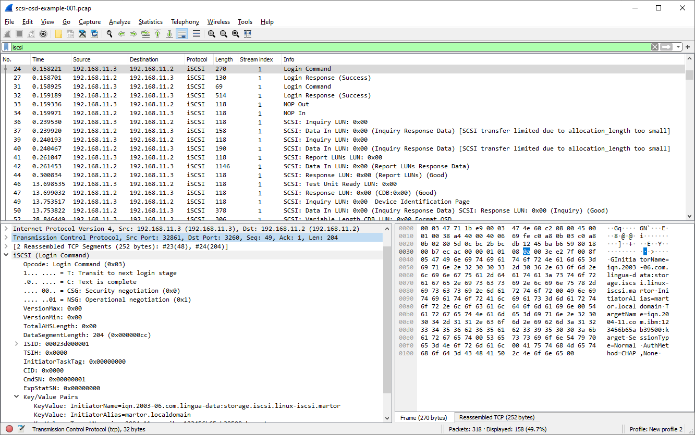

# Internet Small Computer Systems Interface (iSCSI)

From RFC 3720: "The Small Computer Systems Interface ([SCSI](/Small_Computer_System_Interface)) is a popular family of protocols for communicating with I/O devices, especially storage devices.... The iSCSI protocol describes a means of transporting of the SCSI packets over TCP/IP, providing for an interoperable solution which can take advantage of existing Internet infrastructure, Internet management facilities and address distance limitations."

## History

XXX - add a brief description of iSCSI history  
Internet Archive: [IBM Project Page](https://web.archive.org/web/20070318183134/http://www.research.ibm.com/haifa/projects/storage/iSCSI/index.html)

## Protocol dependencies

  - [TCP](/TCP): iSCSI uses [TCP](/TCP) as its transport protocol. The well known TCP port for iSCSI traffic is 3260. Pre-RFC implementations of iSCSI often used other ports.

## Example traffic

XXX - Add example traffic here (as plain text or Wireshark screenshot).  
Sample Capture [scsi-osd-example-001.pcap](https://gitlab.com/wireshark/editor-wiki/-/wikis/uploads/__moin_import__/attachments/SampleCaptures/scsi-osd-example-001.pcap) in `Wireshark 3.2.6`


## Wireshark

The iSCSI dissector is fully functional. It supports drafts 8, 9, 11, 12 and 13. As far as the packet format is concerned draft 13 is identical to the official standard in [RFC3720](https://tools.ietf.org/html/rfc3720). (Rolled into [RFC7143](https://tools.ietf.org/html/rfc7143) )

## Preference Settings

For general use, it is best to have iSCSI desegmentation on and TCP desegmentation on. The dissector will automatically detect whether [HeaderDigest](https://tools.ietf.org/html/rfc7143#section-11.2.3) is used or not for all supported versions of the protocol but not Datadigest. You need to make sure the correct setting is used in preferences for whether [DataDigest](https://tools.ietf.org/html/rfc7143#section-11.2.3) is used or not or Wireshark will fail to decode the packets properly.  
  
**Update:** The preferences were reworked to automatically detect digests:  
- [iscsi: automatically detect data segment digest](https://gitlab.com/wireshark/wireshark/-/commit/46b3dda046b1e6619f50a071d83cf859e335dc98)
- [remove two preference options related to iscsi header digest](https://gitlab.com/wireshark/wireshark/-/commit/ccf7ed00b62dcb63cdb3a9851baa767acbb94013)

## Example capture file

[SAN Protocol Captures (iSCSI, ATAoverEthernet, FibreChannel, SCSI-OSD and other SAN related protocols)](/SampleCaptures#san-protocol-captures-iscsi-ataoverethernet-fibrechannel-scsi-osd-and-other-san-related-protocols)

XXX - Add a simple example capture file to the [SampleCaptures](/SampleCaptures) page and link from here. Keep it short, it's also a good idea to gzip it to make it even smaller, as Wireshark can open gzipped files automatically.

## Display Filter

A complete list of iSCSI display filter fields can be found in the [display filter reference](http://www.wireshark.org/docs/dfref/i/iscsi.html)

Show only iSCSI traffic:

``` 
 iscsi 
```

## Capture Filter

You cannot directly filter iSCSI protocols while capturing. However, if you know the [TCP](/TCP) port used (see above), you can filter on that one.

Capture iSCSI traffic over the default port (3260):

``` 
 tcp port 3260 
```

## External links

  - [RFC 3720](http://www.ietf.org/rfc/rfc3720.txt) *Internet Small Computer Systems Interface (iSCSI)*  (Updates in  [RFC7143](https://tools.ietf.org/html/rfc7143) )

  - [Example coloring rules](uploads/__moin_import__/attachments/ColoringRules/iscsicolor.txt)

## Discussion

I think RFC3720 PDU format is identical to draft13 anyone know for sure? ronnie s

---

Imported from https://wiki.wireshark.org/iSCSI on 2020-08-11 23:15:22 UTC
