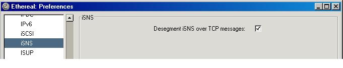

# iSNS Preferences

These are the preferences that control how Wireshark dissects the [iSNS](/iSNS) protocol.

## Desegment iSNS over TCP messages

When you activate this preference, Wireshark will attempt to reassembly all [iSNS](/iSNS) PDUs that span multiple TCP segments into one fully reassembled PDU.  
This is useful for example if a specific implementation only sends the [iSNS](/iSNS) header and the actual [iSNS](/iSNS) command in two separate packets or with servers that respond with massively large replies.  
In order to make this preference take effect, you must also enable reassembly in [TCP\_Reassembly](/TCP_Reassembly).

\-- someone should donate a capture with isns segments spanning multiple segments and link to it as an example from here.

## Preference Strings

Desegment iSNS over TCP messages  

## Discussion

We should sometime later add support to defragment iSNS PDUs that are fragmented at the iSNS layer as well.

---

Imported from https://wiki.wireshark.org/iSNS_Preferences on 2020-08-11 23:15:27 UTC
