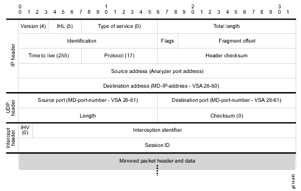

# Juniper Networks mirror encapsulation (Jmirror)

Juniper E Series and MX Series routers have the ability to perform packet mirroring on subscriber interfaces. Packet mirroring enables you to automatically send a copy of a packet to an external host for analysis. Packet mirroring has many uses including lawful intercept, traffic debugging and troubleshooting user networking problems.

The E Series JUNOSe software provides two methods that you can use to configure and manage your subscriber packet-mirroring environment — CLI-based and RADIUS-based.

  - CLI-based packet mirroring — An authorized operator uses the router’s CLI commands to configure and manage packet mirroring. You can mirror traffic related to a specific IP, IPv6, or L2TP interface or traffic related to a particular user. You also use CLI commands to create secure policies that identify the traffic to be mirrored and specify how the mirrored traffic is treated.
  - RADIUS-based packet mirroring — A RADIUS administrator uses RADIUS attributes to configure packet mirroring of a particular user’s traffic. The router creates dynamic secure policies for the mirroring operation.

The MX Series JUNOS software also provides two methods for configuring subscriber packet mirroring — DTCP-based and RADIUS-based.

  - DTCP-based packet mirroring — Dynamic Tasking Control Protocol (DTCP) initiated mirroring creates secure policies to mirror traffic for the subscriber based on DTCP messages. DTCP-initiated subscriber secure policy requires a DTCP-over-SSH connection for the flow-tap service. DTCP leverages a set of commands (currently ADD, DELETE and LIST) for administering packet mirror triggers.
  - RADIUS-based packet mirroring — A RADIUS administrator uses RADIUS attributes to configure packet mirroring of a particular user’s traffic. The router creates dynamic secure policies for the mirroring operation.

When a packet is mirrored an exact duplicate of the packet is created. In order to prevent this duplicate packet from reaching the original destination it is often necessary to wrap the mirrored packet within a new, routable IP packet header. As a result Juniper Networks defined a proprietary UDP/IP packet header format, jmirror, which allows you to redirect the mirrored packet to the intended packet mirror destination. For lawful intercept applications this is commonly the mediation device IP and UDP port.

During a packet mirroring session, the router prepends the jmirror UDP/IP header to each mirrored packet. This prepended header is created by the policy-mirroring action and contains intercept and session identifiers. These jmirror identifiers are used for demultiplexing the various mirrored flows at the mediation device, allowing it to identify the specific stream of packets for a given subscriber amongst all of the mirrored streams that may arrive from different sources.



There is a special logical interface on the E Series router called an analyzer port where the router directs mirrored packets. This interface only allows outgoing packets — all incoming traffic is silently ignored. As a result you typically need to configure a static ARP address on the analyzer interface to allow it to forward packets out an Ethernet interface since it cannot accept incoming ARP replies.

On E Series all mirrored L2TP session packets are prepended with the jmirror UDP/IP header. However, for IP traffic mirroring, the prepend header is optional; the header is added if the mirroring-related Juniper Networks VSAs (VSAs 26-59 and 26-61) are both included in the RADIUS message. For CLI-based mirroring, the **analyzer-udp-port** keyword of the **mirror analyzer-ip-address** command creates the same information contained in the two VSAs. If you do not include the VSAs or the **analyzer-udp-port** keyword, an IP mirroring action is indicated, and the prepend header is not used.

On MX Series routers, all mirrored subscriber traffic (whether DTCP-based or RADIUS-based) is encapsulated in the jmirror header for transport. There is no analyzer interface on the MX as there is on E Series. On MX Series a route lookup is performed on the IP address contained in the prepended header and it is routed accordingly.

## History

The primary driver for the development of the packet mirroring technology in the industry was the anticipation of an FCC order to comply with CALEA <http://www.fcc.gov/pshs/services/calea/> law enforcement regulations. The FCC issued their first order in August 2005 and mandated that CALEA compliance was to be in place within 18 months of the order. This order was motivated by the need to intercept VoIP communications across data networks. The FCC issued their second order in May 2006 which included VoIP as well as broadband subscribers applications, but the deadline was not extended.

The deadline for compliance was set at May 14, 2007. The ruling was such that governments could impose daily fines designed to block services which were not Lawful Intercept compliant.

In anticipation of this ruling, work began well in advance of the first FCC order to develop technology within E Series to meet the expected requirements. The ability to perform packet mirroring on an E Series router was introduced in JUNOSe 5.1 in March of 2004. In this initial release mirroring was entirely CLI based and the mirror commands were visible to anyone with access to the router. Only IP packets could be mirrored and there was no support for the prepended UDP header.

Support for secure policies on E Series came in JUNOSe 6.0 in January of 2005. Secure policies hid the mirror commands from view unless you had command authorization to view them. In this release packet mirroring support was extended to L2TP packets and the prepended UDP header was first introduced. Initially the only way to add the UDP header to a mirrored packet was through the return of Juniper Networks VSAs \[26-58\] LI Action, \[26-59\] Med-Dev-Handle, \[26-60\] Med-Ip-Address and \[26-61\] Med-Port-Number in the RADIUS Accept message. Mirroring could also be triggered for active sessions through a RADIUS CoA messages by returing the aforementioned Juniper Networks VSAs along with the IETF VSA \[44\] Acct-Session-Id.

Additional E Series feature milestones:

  - With JUNOSe 7.0 (released in July 2005), support for prepending the UDP header to a mirrored packet was extended to CLI based mirroring.
  - With JUNOSe 8.0 (released in Jan 2007), the ability to define a classifier for a secure policy was added to control which packets on an interface get mirrored.
  - With JUNOSe 10.1 (released in May 2009), the support for packet mirroring was extended to IPv6 traffic.

Support for subscriber secure policies on MX Series arrived with JUNOS 9.4 in February 2009. MX secure policies utilized the same jmirror header format developed for E Series and was configured using a new **radius-flow-tap** stanza in the **\[edit services radius-flow-tap\]** section of the configuration. This solution covered just IP packets since only DHCP subscriber management was supported in this release. This release supported both DTCP-based and RADIUS-based secure policy mirroring.

Additional MX Series feature milstones:

  - With JUNOS 9.5 (released in April 2009), subscriber management support was extended to dynamic PPP users — however DTCP-based mirrors still only supported interface name triggers which presented a challenge for both PPP and DHCP subscribers whenever the interface unit number was dynamically assigned such as in the case of most dynamic profiles. Therefore RADIUS-based mirror initiation for dynamic PPP and DHCP subscribers remained the most viable option in most cases.
  - With JUNOS 11.4 (released in Nov 2011), support was added for secure policy attachement to IPv6 subscribers. In addition support for a large number of new DTCP-based triggers was added including IP address, PPP username, NAS-port ID, accounting session ID as well as DHCP Option 82 Agent Circuit Id and Agent Remote Id.

## Protocol dependencies

  - [UDP](/UDP): Jmirror is transported over UDP. No official UDP port number is assigned however it defaults to (unassigned) UDP port 30030.

## Example traffic


## Wireshark

The Jmirror dissector is fully functional and verified on E and MX Series routers. The first version of the dissector (2009) was verified with mirrored IP and L2TP flows on E Series. There were hooks in the dissector to decode mirrored IPv6 packets, however there were no actual PCAPs with mirrored IPv6 subscribers available to test with at the time. In July 2012 a defect in the jmirror decoder was identified for IPv6 packet mirrors and a fix for that issue was submitted later that month.

Under the protocol preferences the default UDP port is 30030. This port was chosen since it was unused and happened to be the product of the first six prime numbers 2, 3, 5, 7, 11 and 13 which seemed like a fun idea. Since Jmirror uses an unspecified UDP port number, you can adjust this value as required using the "Edit ==\> Preferences ==\> Protocols ==\> Jmirror" dialogue box in Wireshark.

There is filter expression support for the mirror id (mid) and the session id (sid). These value are 32-bit values and support basic numerical comparison operands. See below for examples of filters.

## Preference Settings

The Jmirror dissector has a UDP port number preference to tell it on which UDP port to listen for Jmirror packets. The default setting for this UDP port is 30030.

## Example capture file

  - [SampleCaptures/jmirror\_ip.pcap](uploads/__moin_import__/attachments/SampleCaptures/jmirror_ip.pcap) — Example which contains mirrored IP packets

  - [SampleCaptures/jmirror\_ipv6.pcap](uploads/__moin_import__/attachments/SampleCaptures/jmirror_ipv6.pcap "Upload new attachment \"jmirror_ipv6.pcap\"") — Example which contains mirrored IPv6 packets

  - [SampleCaptures/jmirror\_l2tp.pcap](uploads/__moin_import__/attachments/SampleCaptures/jmirror_l2tp.pcap) — Example which contains mirrored L2TP packets

## Display Filter

A complete list of Jmirror display filter fields can be found in the [display filter reference](http://www.wireshark.org/docs/dfref/j/jmirror.html)

  - Show only the Jmirror based traffic:
    
    ``` 
     jmirror
    ```

  - Show only the Jmirror traffic with a mirror id of 0x8000:
    
    ``` 
     jmirror.mid==0x8000
    ```

  - Show only the Jmirror traffic with a session id of 0x01:
    
    ``` 
     jmirror.sid==0x01
    ```

## Capture Filter

You cannot directly filter Jmirror protocols while capturing. However, if you know the [UDP](/UDP) port used (see above), you can filter on that one.

Capture only the mirror traffic over port (30030):

``` 
 udp port 30030
```

## External links

  - JUNOS Documentation: [jmirror header](https://www.juniper.net/techpubs/en_US/junos11.4/topics/concept/subscriber-management-subscriber-secure-policy-radius-header.html) - format of jmirror packets

## Discussion

There is also an option to incorporate heuristics into the dissector to eliminate the need to use a "decode as..." or setting the UDP port preference. An heurstic decoder was built as a proof of concept (and it worked pretty well), but isn't part of the current jmirror decoder.

---

Imported from https://wiki.wireshark.org/jmirror on 2020-08-11 23:15:39 UTC
