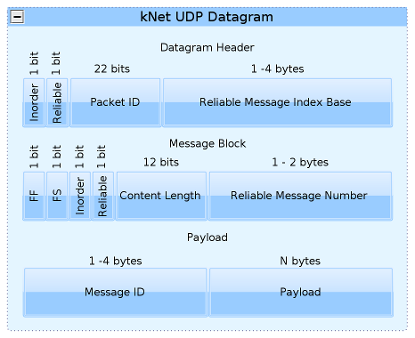
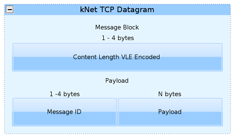

kNet is a connection-oriented network protocol for transmitting arbitrary application-specific messages between network hosts. It is designed primarily for applications that require a method for rapid space-efficient real-time communication.

kNet consists of two major specifications. At a lower level, the Transport-level specification defines methods like:

  - How a session is initialized, maintained and shut down.
  - How data bytes are transferred between hosts.
  - How reliable messages, data ordering requirements and large transfers are handled.
  - How flow management and congestion control may be performed.

Building on top of that, the Application-level specification, along with a reference C++ implementation, offers most notably the following features:

  - How to describe your own application-level protocol sets and their transmission parameters.
  - How to model message dependencies and prioritization.
  - How to perform content-based late data replacement.
  - How to perform data serialization.

These two specifications and the reference implementation form a complete base on which to build a networking server+client application. Alternatively, only the Transport-level specification can be used, while replacing the application-level features with a different model. The implementation exposes the library that it uses internally for data serialization, but it is possible to use any other solution as well. There are plenty of choices available: boost serialization, [CodeSynthesis](/CodeSynthesis) XSD, Eet, gSOAP, MFC, Google protobuf, Qt QDataStream, s11n, Poco Serializer, Sweet Persist, tpl, xserial, yaml-cpp, or integrate your own.

Downloadable prebuilt packages of the library or the samples are not yet available. The official source repository of kNet is hosted at <https://bitbucket.org/clb/knet/>

# kNet Transport over UDP

This specification defines the details of kNet Transport layer over UDP.

kNet over UDP offers the following enhancements over raw UDP datagrams:

  - **Connection-oriented**. kNet implements virtual sessioning on top of the connectionless UDP layer.

  - **Reliable messaging**. Datagrams that are flagged reliable are retransmitted until they reach their destination.

  - **In-order messaging**. Messages that have ordering requirements are applied at the receiving end in their proper order. The application can model the dependencies as appropriate, using no/single/multiple in-order transmission channels or an arbitrary dependency graph.

  - **Message coalescing**. A single UDP datagram can carry as many application-level messages as can fit, instead of a naive 1:1 mapping between datagrams and messages that is sometimes used.

  - **Byte-efficient transport**. On average, the per-datagram overhead is 3-10 bytes, and the per-message overhead is 3-5 bytes. kNet is suitable for applications profiled to transfer large amounts of small messages.

  - **Large message transfers**. UDP datagram has a size limit of circa 1400 bytes, but the protocol supports transparent fragmentation and reassembling of large messages to hide this limit. The maximum message size is 2^30 \* 1400 bytes, i.e. virtually unlimited.

The major advantages of using kNet over UDP instead of TCP are the following:

  - **Unreliable messaging**. Datagrams that are not flagged reliable are treated unreliable and resources will not be wasted in guaranteeing their delivery.

  - **Out-of-order messaging**. If a TCP frame is lost, the stream transfer halts until the loss is detected and retransmitted. With UDP, messages without in-order requirements can be delivered to the application regardless of whether other frames have been lost.

  - **NAT Punchthrough**. With UDP, Peer-to-peer communication between two clients that are both behind a NAT is possible. For more information, see [RakNet](/RakNet) or Jon Watte.

The protocol specification was designed keeping in mind the possibility of implementing a certain set of performance-related features. For more details on this, see the C++ reference implementation.

The image below shows an overview of the structural format of a kNet UDP datagram.

Structure of the kNet UDP Datagram

# kNet Transport over TCP

It is possible to run kNet connections on top of TCP. This has the following advantages over using UDP:

  - A restricting firewall may block UDP connections, which makes kNet over UDP impossible.
  - A poor ISP may consider UDP communication as P2P traffic and serve it with lower priority than TCP, throttle the maximum bandwidth, or even scramble it.
  - Traditional TCP congestion control is applied, which is the method most routers are optimized for.

However, using kNet in TCP mode has the following limitations:

  - No support for out-of-order messaging. This results in increased latency in the presence of packet loss.
  - No support for unreliable datagrams, which makes TCP a poor fit for streaming lossy real-time content.
  - Message prioritization is more difficult since the outbound TCP send queue cannot be modified after data is submitted to it.
  - Because of the same reason as above, no support for late data choice.
  - No support for multiple virtual communication channels, or other message dependency modelling methods.
  - The server cannot operate in stealth mode.

kNet over TCP implements RTT estimation and fragmented transfers in a similar way to when using kNet over UDP. However, these two transport methods are not equivalent in features. For example, kNet over TCP does not support UDP features such as **[InOrder](/InOrder) Messages**, **Flow Control** or **Session Management**.

**TCP Stream Byte Format**

The byte format used for serializing messages in the TCP stream differs somewhat from the UDP counterpart and is very straightforward. The data if formed by simply concatenating the following **Message Block** fields one after another until the connection is closed. There are no headers or data bytes at the start of the stream or in between the Message blocks. The structure of the TCP packet can be found below.

# kNet Transport over SCTP

kNet SCTP is currently quite the same as the kNet TCP so the information located in the TCP section goes here as well.

# Example Traffic

The traffic captured in these samples are from port 2350 so remember to change the port in Wireshark Preferences dialog

[kNet-UDP-Packets.pcap](uploads/__moin_import__/attachments/kNet/kNet-UDP-Packets.pcap)

[kNet-TCP-Packets.pcap](uploads/__moin_import__/attachments/kNet/kNet-TCP-Packets.pcap)

[kNet-SCTP-Packets.pcap](uploads/__moin_import__/attachments/kNet/kNet-SCTP-Packets.pcap)

**Note:** The samples contain a lot of packets which the kNet dissector says are unknown. Actually these packets are application specific data from realXtend Naali. These messages are not specified in the kNet specification so they are treated as unknown/appdata. This is because one can send arbitrary application data over kNet so it is impossible to know exactly what kind of data the payload section contains.

# Other

The display filter for UDP is **udp and** **knet** , for TCP **tcp and knet** and for SCTP **sctp and knet**

The port can be changed from the Wireshark preferences dialog. The default port is 2345.

---

Imported from https://wiki.wireshark.org/kNet on 2020-08-11 23:15:51 UTC
